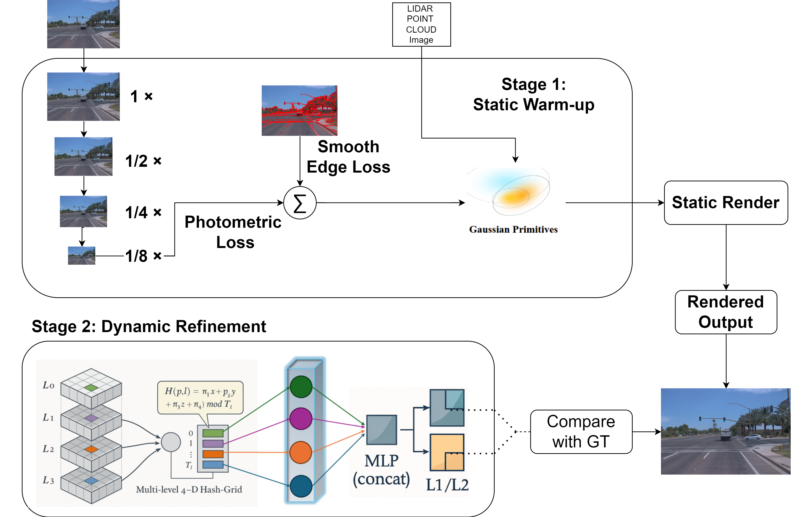
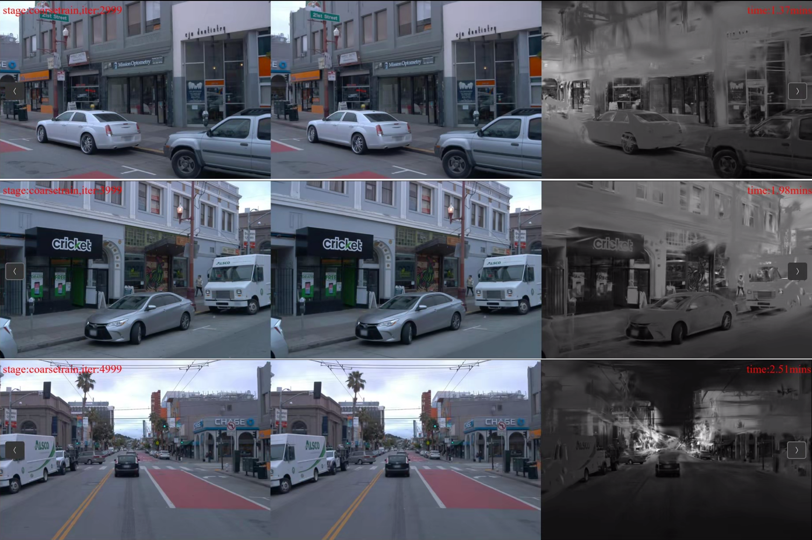
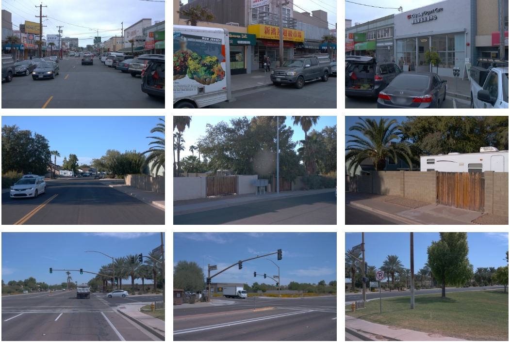

# Self-Supervised Street Gaussian Model Based on Hash Encoder

## Project Introduction

This project proposes a self-supervised street scene modeling method based on 3D Gaussians, specifically designed for dynamic scene reconstruction and novel view synthesis in autonomous driving scenarios. We use a multi-resolution hash encoder for 4D spatio-temporal feature encoding to achieve efficient dynamic scene modeling.

### Core Technical Approach

The project adopts a two-stage training strategy combined with advanced hash encoding technology:

1. **Static Scene Reconstruction Stage**: First model the static background to build the base 3D Gaussian representation of the scene  
2. **Dynamic Scene Modeling Stage**: Based on the static model, use the hash encoder to learn the spatio-temporal deformation of dynamic objects

### Main Technical Features

- ✅ **Multi-resolution hash encoder**: Efficient 4D spatio-temporal feature encoding with significantly reduced memory usage
- ✅ **Two-stage training strategy**: Progressive training from static → dynamic to improve training efficiency
- ✅ **Self-supervised learning**: No additional annotations required, training only with multi-view images
- ✅ **High-quality rendering**: Supports real-time rendering and high-quality novel view synthesis



## 📊 Key Experimental Results from the Paper

### 1. Quantitative Comparison on Waymo-NOTR Dataset
| Method | PSNR ↑ | SSIM ↑ | LPIPS ↓ | DPSNR ↑ | DSSIM ↑ |
|--------|--------|--------|---------|---------|---------|
| 3D GS | 27.68 | 0.845 | 0.142 | 23.53 | 0.754 |
| EmerNeRF | 30.64 | 0.897 | 0.102 | 27.61 | 0.856 |
| LiHi-GS | 32.65 | 0.917 | 0.098 | 28.38 | 0.889 |
| S³Gaussian | 30.10 | 0.895 | 0.113 | 23.78 | 0.728 |
| **Ours** | **34.06** | **0.947** | **0.045** | **28.97** | **0.871** |

💡 **Highlights**: Compared with S³Gaussian, PSNR improved by **+3.96 dB**, LPIPS decreased by **60%**, and memory usage was reduced by half.

### 2. Ablation Study (Waymo-NOTR, dynamic32)
| Setting | PSNR↑ | LPIPS↓ | Memory (GB) | Time (h) |
|---------|-------|--------|-------------|----------|
| Baseline (S³) | 30.10 | 0.113 | 40.3 | 2.12 |
| + Lphoto+Lsmooth | 32.81 | 0.069 | 21.6 | 1.03 |
| + Hash grid | 32.36 | 0.078 | 21.4 | 1.02 |
| **+ ℓ1/ℓ2 (full)** | **34.06** | **0.045** | 21.9 | 1.02 |

### 3. Rendering Results

#### 📌 Scene Reconstruction (Left: GT | Middle: Rendering Result | Right: Depth Map)
  

#### 📌 Novel View Synthesis (Three scenes: Front / Front-Left / Front-Right)
  

### 4. Dynamic Rendering Demo


## Environment Setup

### System Requirements

- **OS**: Ubuntu 22.04 (recommended)  
- **Python**: 3.9  
- **PyTorch**: 1.13.1+cu116 or 2.2.1+cu118  
- **CUDA**: 11.6+ (recommended) or 11.8  
- **RAM**: 16GB+  
- **VRAM**: 8GB+ (12GB+ recommended)  

### Installation Steps

1. **Clone the repository**
```bash
git clone <https://github.com/Embracely/4dhash/blob/main/README.md> --recursive
cd <project-directory>

```

2. **Create and activate a Conda environment**
```bash
conda create -n 4DHash python=3.9 
conda activate 4DHash
```

3. **Install Python dependencies**
```bash
pip install -r requirements.txt
pip install -e submodules/depth-diff-gaussian-rasterization
pip install -e submodules/simple-knn
```


## Create dataset directories

### 1. Register a Waymo Open Dataset account

First, register an account at [Waymo Open Dataset](https://waymo.com/open/) and install the gcloud SDK. Refer to the [Official Documentation](https://cloud.google.com/sdk/docs/install) for detailed steps.

### 2. Create dataset directories

```bash
mkdir -p ./data/waymo/raw   
mkdir -p ./data/waymo/processed 
```

### 3. Download raw data

**Method 1: Use the download script (recommended)**

Download specific scenes (e.g., scene 22, 700, 754):
```bash
python data/download_waymo.py \
    --target_dir ./data/waymo/raw \
    --scene_ids 22 700 754
```

Download predefined dataset splits:
```bash
# Download static scene dataset (Static32)
python data/download_waymo.py --split_file data/waymo_splits/static32.txt

# Download dynamic scene dataset (Dynamic32)
python data/download_waymo.py --split_file data/waymo_splits/dynamic32.txt
```

Method 2: Manual download

If you cannot use the script, you can manually download the data from the [Waymo Console](https://console.cloud.google.com/storage/browser/waymo_open_dataset_scene_flow/train).

### 4. Data preprocessing

Use our provided preprocessing script:
```bash
python preprocess_main.py \
    --data_root data/waymo/raw/ \
    --target_dir data/waymo/processed \
    --split training \
    --process_keys images lidar calib pose dynamic_masks \
    --workers 4 \
    --scene_ids 022
```

For batch processing:

```bash
python preprocess_main.py \
    --data_root data/waymo/raw/ \
    --target_dir data/waymo/processed \
    --split training \
    --process_keys images lidar calib pose dynamic_masks \
    --workers 8 \
    --split_file data/waymo_splits/dynamic32.txt
```

**Note**: If you encounter the error TypeError: 'numpy._DTypeMeta' object is not subscriptable, please use pip install numpy==1.26.1.

### 5. Data directory structure

After preprocessing, the data directory structure will be:

```
data/waymo/processed/
├── training/
│   ├── 022/                    # Scene ID
│   │   ├── dynamic_masks/      # Dynamic masks
│   │   ├── ego_pose/           # Vehicle poses
│   │   ├── extrinsics/         # Camera extrinsics
│   │   ├── images/             # Image data
│   │   ├── intrinsics/         # Camera intrinsics
│   │   ├── lidar/              # LiDAR data
│   │   └── sky_masks/          # Sky masks
│   └── ...                     # Other scenes

```

Training Workflow

### 🚀 Recommended: Use the integrated training script

We recommend using the integrated training script, which automatically completes the static scene training → dynamic scene training workflow:

**Full training**
```bash
./train_integrated.sh \
    --model_path ./work_dirs/integrated/full_training \
    --source_path ./data/waymo/processed/training/022
```

**Quick test**
```bash
./train_integrated.sh \
    --model_path ./work_dirs/integrated/test_training \
    --source_path ./data/waymo/processed/training/022 \
    --mode test
```

**Custom iterations**
```bash
./train_integrated.sh \
    --model_path ./work_dirs/integrated/custom_training \
    --source_path ./data/waymo/processed/training/022 \
    --iterations 30000
```

### Advanced training options

**1. Train with hash encoder (single stage)**
```bash
./train_hash_encoder.sh \
    --model_path ./work_dirs/hash_training \
    --source_path ./data/waymo/processed/training/022 \
    --encoder hash \
    --task scene_reconstruction \
    --mode full
```

**2. Manual two-stage training**

If you want more fine-grained control, you can manually execute the two stages:

```bash
# Stage 1: Static scene reconstruction
python train.py \
    -s ./data/waymo/processed/training/022 \
    --model_path ./work_dirs/manual/stage1 \
    --configs arguments/phase1_static.py \
    --iterations 5000

# Stage 2: Dynamic scene training
python train.py \
    -s ./data/waymo/processed/training/022 \
    --model_path ./work_dirs/manual/stage2 \
    --configs arguments/phase2_dynamic.py \
    --prior_checkpoint ./work_dirs/manual/stage1/chkpnt_fine_5000.pth \
    --iterations 50000 \
    --encoder_type hash
```

### Training parameter description

| Parameter | Description | Default |
|------|------|--------|
| `--model_path` | Model output path | Required |
| `--source_path` | Data source path | Required |
| `--mode` | Training mode: test (quick test) or full (full training) | `full` |
| `--iterations` | Iterations for the second stage | 50000 |
| `--encoder_type` | Encoder type: hash or hexplane | `hash` |

## Evaluation & Visualization

### Performance evaluation

After training, use the evaluation script to calculate metrics:

```bash
python eval_metrics.py \
    --model_path ./work_dirs/integrated/full_training \
    --iteration 50000
```

### Visualization results

Generate rendering videos and visualizations:

```bash
python train.py \
    -s ./data/waymo/processed/training/022 \
    --model_path ./work_dirs/integrated/full_training \
    --start_checkpoint ./work_dirs/integrated/full_training/chkpnt_fine_50000.pth \
    --eval_only
```

生成的结果包括：
- RGB rendering videos
- Ground truth RGB videos
- Depth videos
- Dynamic object RGB videos
- Static background RGB videos


### Core files

- `train_integrated.sh` - **Recommended one-click training script**
- `arguments/integrated_training.py` - **Training configuration file**
- `scene/hash_encoder.py` - **Hash encoder implementation**
- `scene/deformation_hash.py` - **Hash deformation network**
- `eval_metrics.py` - **Evaluation script**

## Acknowledgements

This project was implemented with reference to the following excellent open-source projects:

- [4D Gaussians](https://github.com/hustvl/4DGaussians/tree/master) - 4D Gaussian modeling technology
- [EmerNeRF](https://github.com/NVlabs/EmerNeRF) - Data processing pipeline
- [StreetGaussians](https://github.com/zju3dv/street_gaussians) - Street scene modeling reference

Thanks to all open-source contributors for their hard work!

## Related Work

The technical approach of this project was inspired by the following research:

```bibtex
@article{huang2024s3gaussian,
    title={S3Gaussian: Self-Supervised Street Gaussians for Autonomous Driving},
    author={Huang, Nan and Wei, Xiaobao and Zheng, Wenzhao and An, Pengju and Lu, Ming and Zhan, Wei and Tomizuka, Masayoshi and Keutzer, Kurt and Zhang, Shanghang},
    journal={arXiv preprint arXiv:2405.20323},
    year={2024}
}
```

## License

This project follows the license of the original project. Please refer to [LICENSE.md](LICENSE.md) for details.

## Quick Start Example

```bash
# 1. Prepare data
python preprocess_main.py --data_root data/waymo/raw/ --target_dir data/waymo/processed --split training --scene_ids 022

# 2. Start training
./train_integrated.sh --model_path ./work_dirs/my_experiment --source_path ./data/waymo/processed/training/022

# 3. Evaluate results
python eval_metrics.py --model_path ./work_dirs/my_experiment --iteration 50000

```


